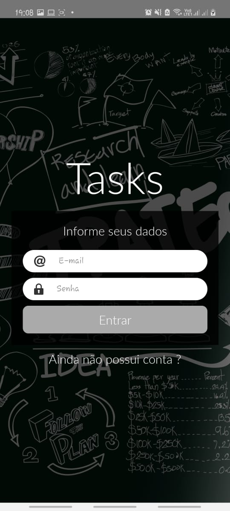
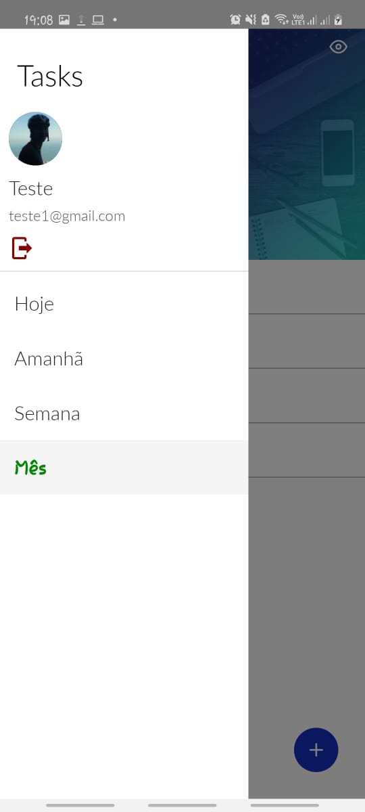
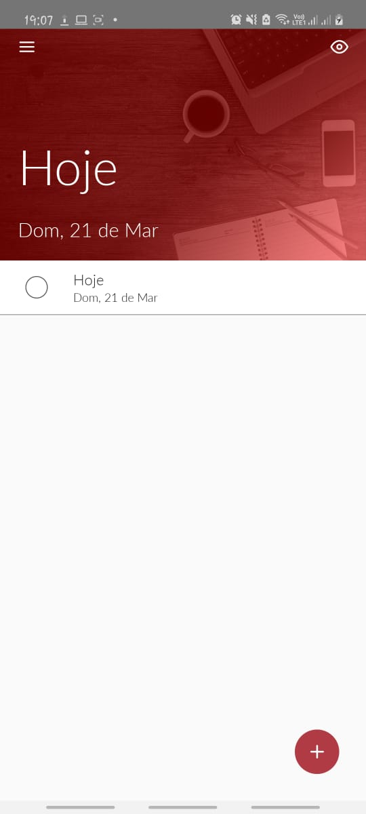
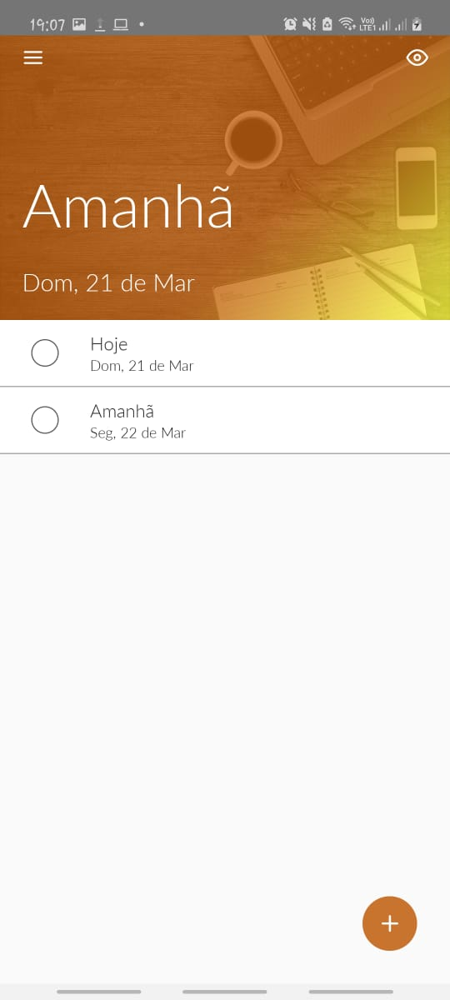
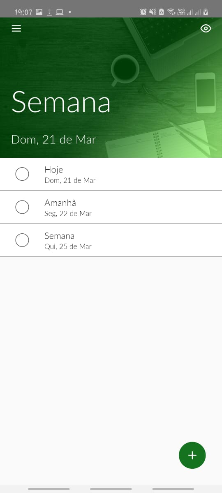
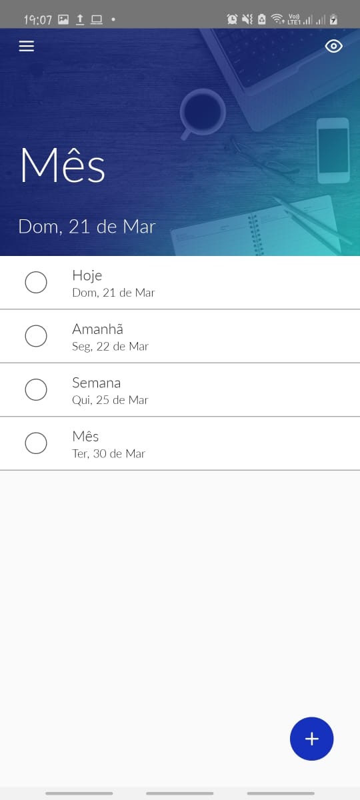

# Tasks-react-native

## Screenshot
***
  
  
  
  
  
  
  

## The Project
***
The project is an application for referencing daily tasks and can schedule tasks for one month

## Running
***
 For the project to work it is necessary to connect to the api [tasks-backend](https://github.com/thiagobonfim0310/tasks-backend). In case it is running on a personal computer, it is necessary to check the file [common.js](https://github.com/thiagobonfim0310/tasks-react-native/blob/main/src/common.js) and change the url by placing your local network IP

 ## Functions
***
**Registration:** The project allows you to register with an email containing an **@** and a password of at least 6 digits

**Login:**  The project login in by saving an authentication token so login only happens once

**Add Task:** The project allows you to add tasks by scheduling the task completion date

**Task Completed:** The project allows you to mark the tasks as completed

**Remove Task:** The project allows you to remove a task by dragging to the right, or dragging to the left and clicking the button